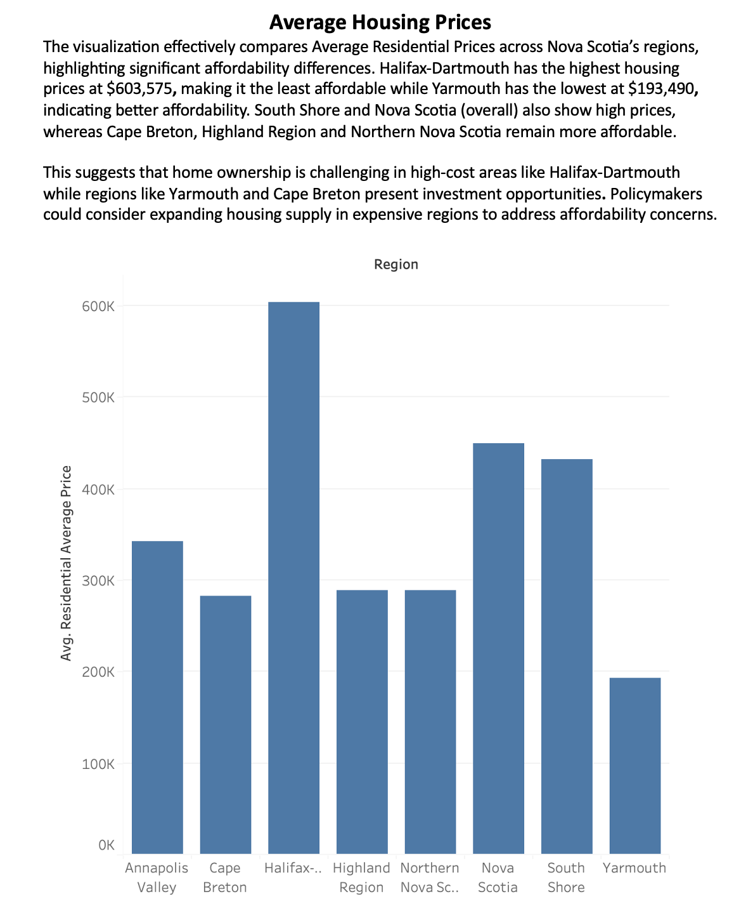
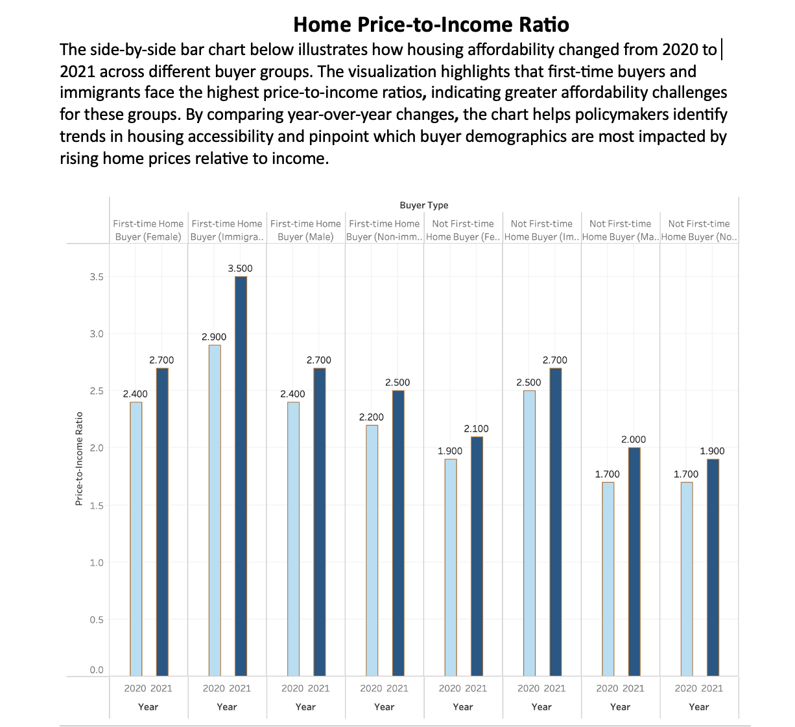
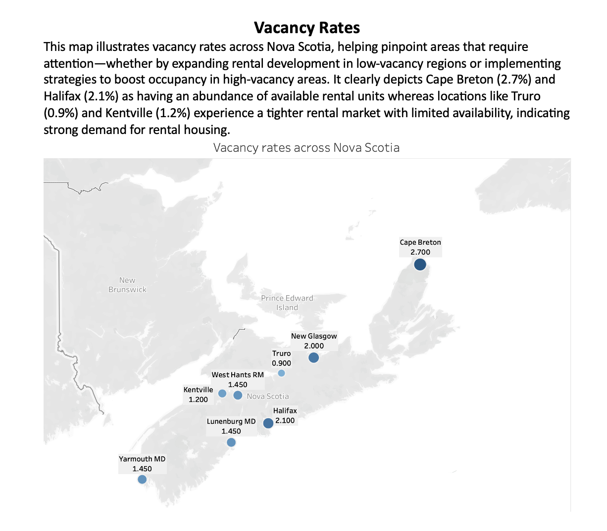
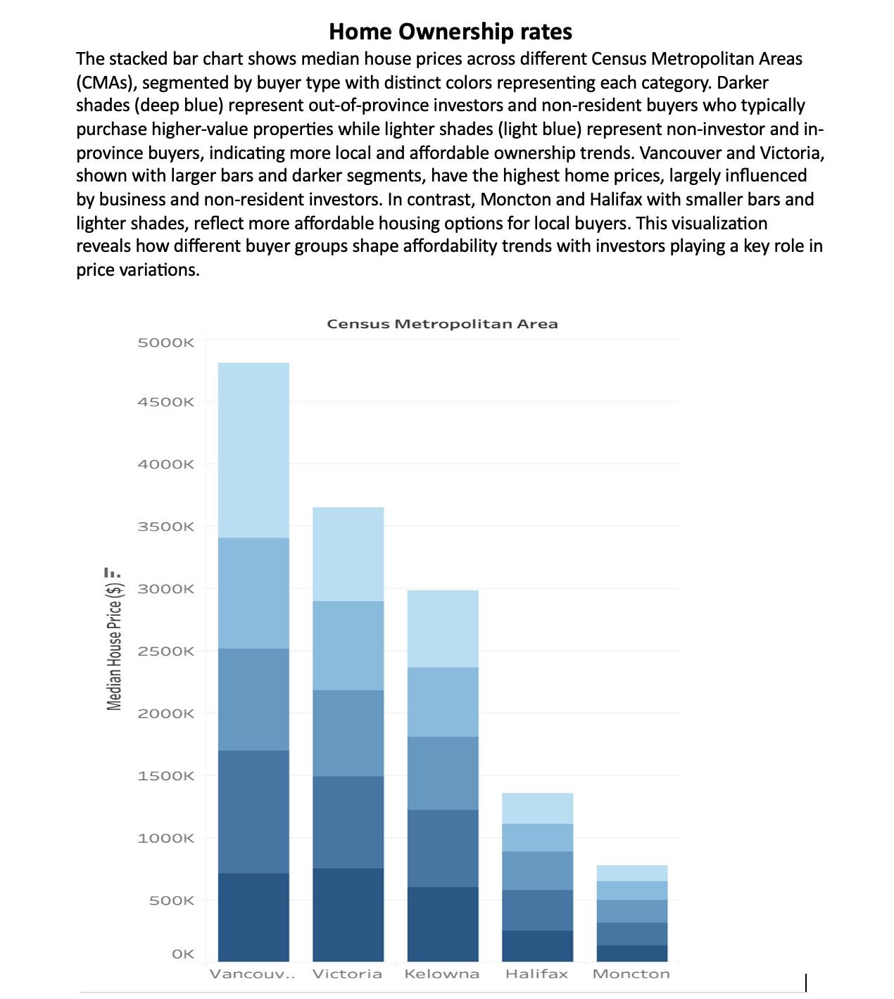
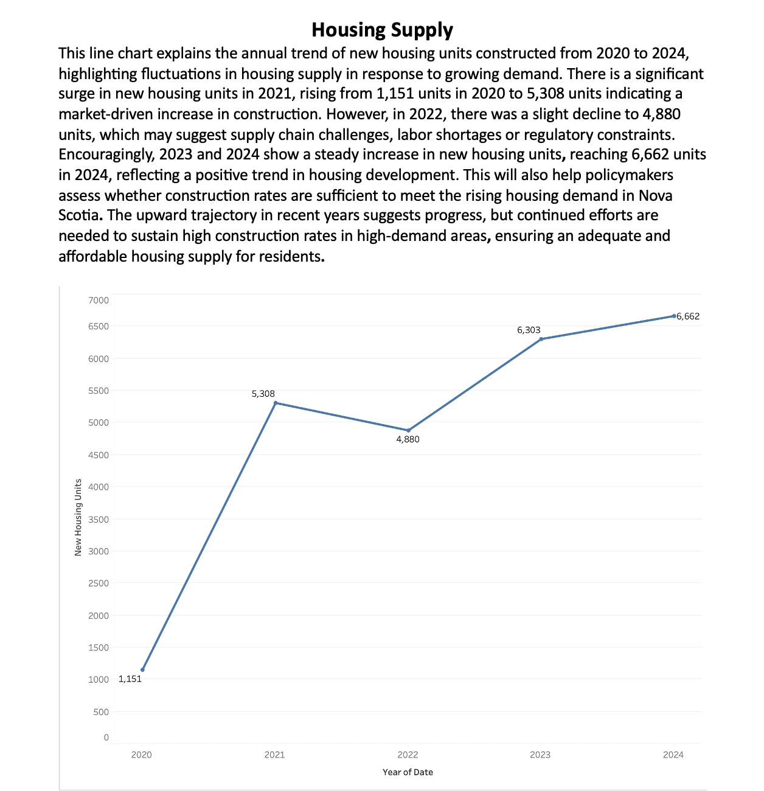
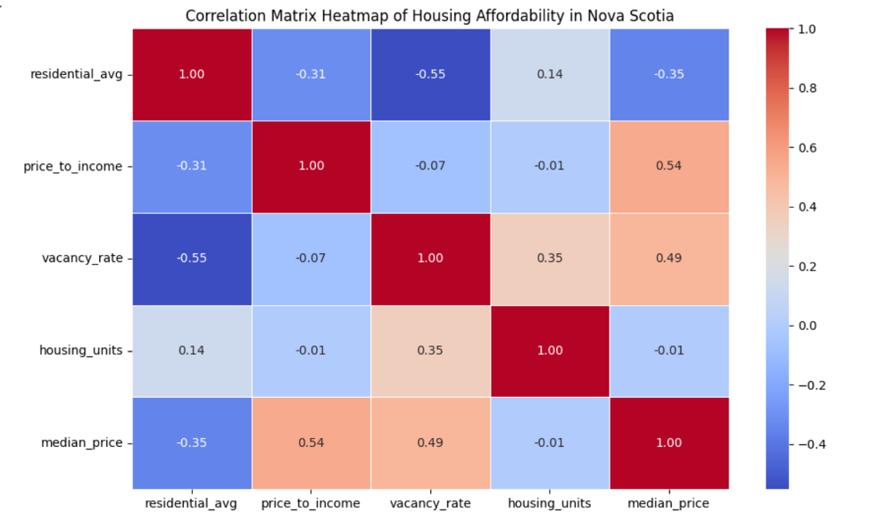
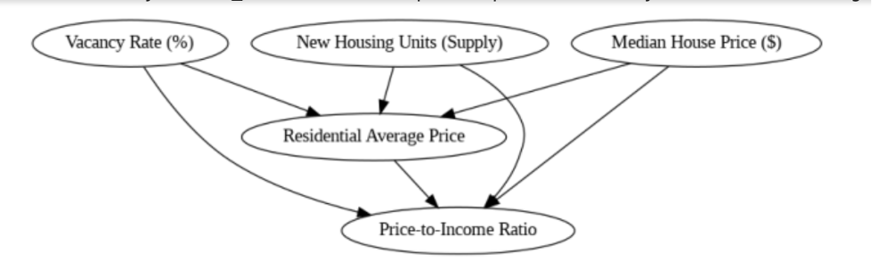

# Housing Affordability: A Critical Analysis
*A decision intelligence study for understanding the dynamics in Housing availability*

*By: Chinelo Okafor*

## Table of Content
1.⁠ ⁠[Introduction](#Introduction)

2.⁠ ⁠[Research Objectives](#research-objectives)

3.⁠ ⁠[Key Performance Indicators (KPIs)](#Key-Performance-Indicators)

    - (a) [Average House Prices](Average-House-Prices)
   
    - (b) [Home Price-to-Income Ratio](Home-Price-to-Income-Ratio)
   
    - (c)[Vacancy Rates](Vacancy-Rates)
   
    - (d) [Home Ownership Rates](Home-Ownership-Rates)
   
    - (e) [Housing Supply](Housing-Supply)
    
4. 

## Introduction
Housing affordability is a growing concern in Nova Scotia with rising home prices, increasing rent burdens and challenging mortgage conditions creating barriers for many individuals and families seeking stable housing. This study utilizes modern data analysis tools including Python, Tableau and various statistical methods to explore housing affordability in Nova Scotia. The primary focus will be on factors such as home prices, rent-to-income ratios, vacancy rates and mortgage rates with the goal of providing actionable insights for policymakers, housing developers and stakeholders to address the housing affordability crisis.

[Read detailed background information here](https://github.com/chinelokafor/Term-Project/blob/main/Background.md)

## Research Objectives
This study aims to:
1.	Analyze trends in housing affordability across different regions in Canada, with a focus on key urban centers.
2.	Identify the socioeconomic, market factors influencing housing affordability.
3.	Assess the relationship between housing affordability and other social indicators such as income inequality and population growth.
4.	Develop predictive models to project future housing affordability under various market conditions such as "Develop predictive models to project future housing affordability under various market conditions such as rising mortgage rates, fluctuating housing supply, shifts in rental demands, changes in household income levels etc. 
5.	Provide recommendations for policy makers and stakeholders to improve housing affordability with a focus on long-term solutions that promote both market stability and social equity.

## Key Performance Indicators (KPIs)

1. **Average House Prices** - 
Tracking average house prices within Nova Scotia helps assess market trends, affordability shifts and the impact of economic factors, guiding policymakers in making informed housing decisions.
  -	Target: Monitor annual price changes to identify affordability shifts.
  -	Measured quarterly based on regional data from Statistics Canada and other sources.
    
  
2. **Home Price-to-Income Ratio** -
Measures the affordability of residential properties by comparing the median home sale price to the median household income of buyers. A higher ratio indicates lower affordability, meaning homes are more expensive relative to income.
- Monitor changes in affordability trends over time (2020 vs. 2021).
- Compare affodability across different buyer groups (First-time vs. Not First-time, Immigrants vs. Non-immigrants).
-	Identify groups most affected by affordability constraints.

 
3. **Vacancy Rates** -
Analyzing vacancy rates provides insights into rental supply and demand, helping identify regions that require targeted housing development and policy interventions.
- Target: Identify areas with high vacancy rates that could benefit from increased rental development.
- Measured monthly through real estate transaction data.

4. **Home Ownership Rates** -
Tracking home ownership rates provides insights into housing accessibility, economic stability, and affordability trends, helping policymakers develop strategies to support sustainable homeownership.
- The interest rates impacting homeownership affordability, reflecting broader economic conditions.
- Target: Track changes annually to assess the impact of policies on homeownership growth.

5. **Housing Supply** -
Measuring annual housing supply against growing demand helps ensure adequate development, supporting strategic initiatives to meet the evolving needs of Nova Scotia’s residents.
-  The number of new housing units built annually, assessing the adequacy of the supply to meet growing demand.
- Action: Increase the rate of housing construction in high-demand areas.

## Data Analysis

### Analysis of the KPI 

#### (a) Figure 1.1

#### (b) Figure 1.2

#### (c) Figure 1.3

#### (d) Figure 1.4

#### (e) Figure 1.5

## Statistical Analysis

### Analysis of the Causal Impact of Residential Average Price on Housing Affordability in Nova Scotia

#### (a) Introduction 
This analysis explores the relationship between key housing affordability metrics in Nova Scotia using the following key performance index (KPI): average housing prices, home price-to-income ratio, vacancy rates, home ownership rates and housing supply while focusing on the causal impact of residential average price on the price-to-income ratio. By examining causal relationships, correlation patterns and employing causal inference techniques, the study aims to identify how changes in residential prices affect housing affordability while controlling for factors like median house price, vacancy rate, and new housing units (housing Supply). The findings are intended to shed light on the dynamics of the housing market and provide insights for improving housing affordability.

#### (b) Correlation Matrix Heatmap
The matrix heatmap shows the relationships among residential average price and median house price where it shows a moderate negative correlation of -0.35, meaning when one price metric increases, the other tends to decrease slightly, possibly indicating differences between the median and average prices. It also highlights Price-to-Income Ratio is negatively correlated with Residential Average Price (-0.31) and strongly negatively correlated with Vacancy Rate (-0.55). This suggests that as housing prices increase, affordability decreases, and higher vacancy rates might indicate lower affordability or market supply issues.
•	Vacancy Rate is positively correlated with Housing Units (housing supply) (0.35), suggesting that areas with more housing supply may experience lower vacancy rates, aligning with expectations in more competitive housing markets.
•	Housing Units has a weak correlation with other factors like Price-to-Income Ratio (0.14) and Median House Price (-0.01), showing that the number of housing units does not have a strong direct relationship with these measures, despite the causal inference diagram indicating a potential effect on prices.

##### (a) Figure 2.1

#### (c) Causal Graph
The causal relationships shows that new housing units (housing supply) affects residential average price, which in turn influences the median house price and the price-to-income ratio. Higher residential average prices tend to worsen affordability (higher Price-to-Income Ratio) as prices rise.

##### (a) Figure 2.2

#### (d) Causal Inference & Confounders
•	Confounders like interest rates and inflation could bias the results, affecting both prices and affordability.
•	The correlation matrix suggests potential indirect relationships but confounders such as income levels or interest rates should be considered for clearer causal inference.

#### (e) Causal Estimand
The causal estimand models the effect of residential average price on the price-to-income ratio, controlling for median house price, vacancy rate, and new housing units (housing supply) using a backdoor criterion.

#### (f) Realized Estimand
The realized estimand is specified as a linear regression model:
Price-to-Income Ratio ~ Residential Average Price + Vacancy Rate (%) + New Housing Unit (housing supply) + Median House Price ($).
This indicates that residential average price is being assessed for its effect on price-to-income ratio, adjusting for other factors (confounders).

#### (g)  Estimate of Causal Effect
The mean estimate of the causal effect is 4.47×10−64.47 \times 10^ {-6}4.47×10−6, which suggests that the causal effect of residential average price on price-to-income ratio is very small, possibly negligible given the scale of the effect. This result indicates that the residential average price may have a minimal impact on the price-to-income ratio, or that the data does not provide sufficient variation or observations to detect a stronger effect.

#### (h) Potential Causal Pathways
Vacancy rate affects price-to-income ratio through housing supply and residential average price.
Higher vacancy rates might reduce housing prices, improving affordability.

## Refutation Analysis
The refutation analysis of the causal effect of residential average price on the price-to-income ratio yielded a p-value of 0.40. This suggests that fluctuations in residential average price may not have a meaningful or detectable impact on housing affordability as measured by the price-to-income ratio. The results imply that other confounding factors such as interest rates and income levels, might play a more dominant role in shaping affordability trends. 

## Conclusion
This analysis suggests that while residential average price has a theoretical impact on the price-to-income ratio, the estimated causal effect is extremely small and statistically insignificant with a value of 4.47e-6. The weak correlations observed in the heatmap between residential average price and affordability measures further support this finding. Additionally, while causal pathways indicate that higher vacancy rates may reduce prices and improve affordability, confounding factors such as interest rates and income levels may influence both residential average price and the price-to-income ratio, potentially biasing the results.

## References
1.	Allen, J., & McLaren, N. (2018). Housing affordability in Canada: Challenges and policy implications. Canadian Journal of Urban Research, 27(2), 45-66.
2.	Canada Mortgage and Housing Corporation. (2020). Housing affordability in Canada: Key trends and factors. https://www.cmhc-schl.gc.ca/
3.	Canada, S. (2022). Housing affordability and the Canadian housing market. Statistics Canada. https://www.statcan.gc.ca/
4.	Glaeser, E. L., & Gyourko, J. (2018). The impact of housing affordability on economic mobility and inequality. Journal of Economic Perspectives, 32(3), 1-30. https://doi.org/10.1257/jep.32.3.1
5.	Stone, M. E. (2006). What is housing affordability? The case for the residual income approach. Housing Studies, 21(4), 529-551. https://doi.org/10.1080/02673030500113589
6.	World Bank. (2020). Global housing affordability: Trends and insights. World Bank Group. https://www.worldbank.org/
7.	Statistics Canada. (n.d.). Housing market indicators. Statistics Canada. https://www150.statcan.gc.ca/
8.	Nova Scotia Open Data. (n.d.). Real estate transactions. Nova Scotia Open Data. https://data.novascotia.ca/
9.	World Bank. (n.d.). Global housing index. World Bank Open Data. https://data.worldbank.org/
10.	Bank of Canada. (2023). Monetary policy and housing affordability report. https://www.bankofcanada.ca
11.	Canada Mortgage and Housing Corporation (CMHC). (2023). Housing market outlook. https://www.cmhc-schl.gc.ca
12.	Canadian Centre for Policy Alternatives. (2023). The affordability crisis: Housing in Canada. https://policyalternatives.ca
13.	Canadian Real Estate Association (CREA). (2023). Real estate market statistics. https://crea.ca
14.	Organisation for Economic Co-operation and Development (OECD). (2022). Housing affordability and policy solutions in advanced economies. https://www.oecd.org](https://www.oecd.org
15.	Statistics Canada. (2023). Housing trends and affordability statistics. https://www.statcan.gc.ca

